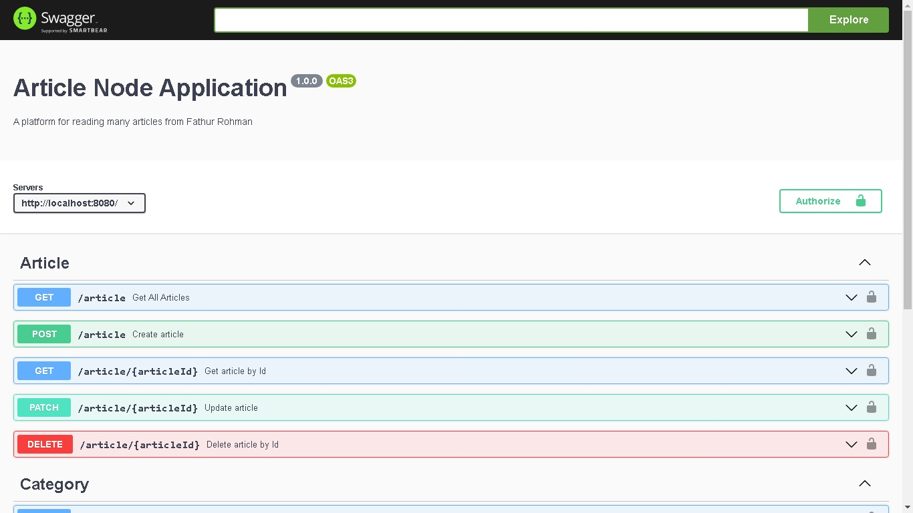
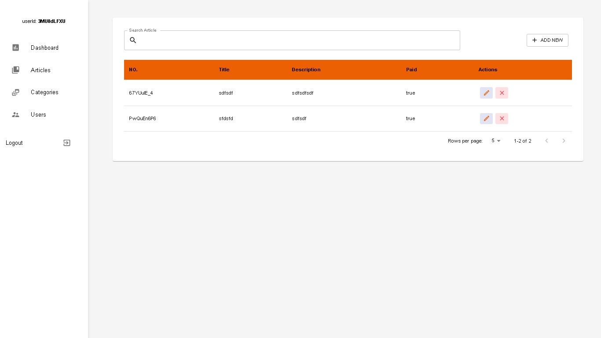

# Articel Node Application

A platform from reading many article from Fathur Rohman






## Feature Application

- Authentication user, LOGIN/REGISTER/LOGOUT using jsonwebtoken
- Dashboard Page
- Creat, Update, Delete Article 
- Create, Delete Category
- Update, Delete User
- Search All Categories Data
- Sorting Table
- Swagger for documentation


## Usage
Use docker for manage container and image

### We can start the multi-container system using the following simple command:

```
docker-compose up --build
``` 

At last, we can open http://localhost:3000 to see our React Frontend.
The backend server is live on http://localhost:8000
And MongoDB is running on http://localhost:27017
